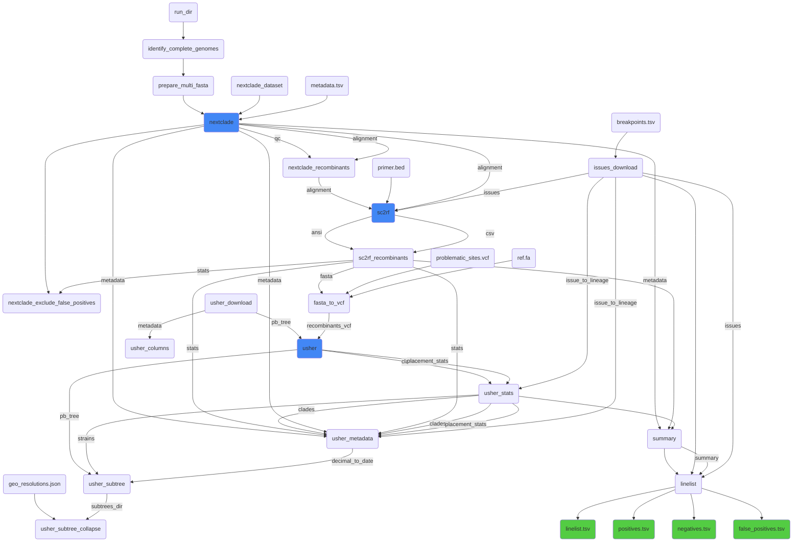

# Recombinant Screen for SARS-CoV-2

This pipeline is based directly on [ktmeaton/ncov-recombinant](https://github.com/ktmeaton/ncov-recombinant).
We've adapted the original Snakemake pipeline into a Nextflow pipeine, and made minor adjustments to fit our
systems and SARS-CoV-2 sequence datasets.

## Overview




## Usage

```
nextflow run BCCDC-PHL/ncov2019-recombinant-screen \
  -profile conda --cache ~/.conda/envs \
  --run_dir </path/to/artic_analysis_run_dir> \
  --outdir </path/to/output_dir>
```

## Input

## Output
The output consists of five `.tsv` files:

```
output
├── <run_id>_recombinant_screen_false_positives.tsv
├── <run_id>_recombinant_screen_linelist.tsv
├── <run_id>_recombinant_screen_negatives.tsv
├── <run_id>_recombinant_screen_positives.tsv
└── <run_id>_recombinant_screen_summary.tsv
```
